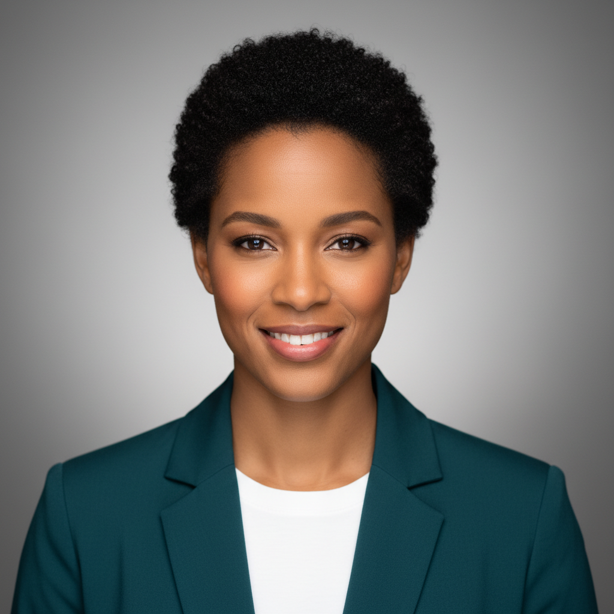
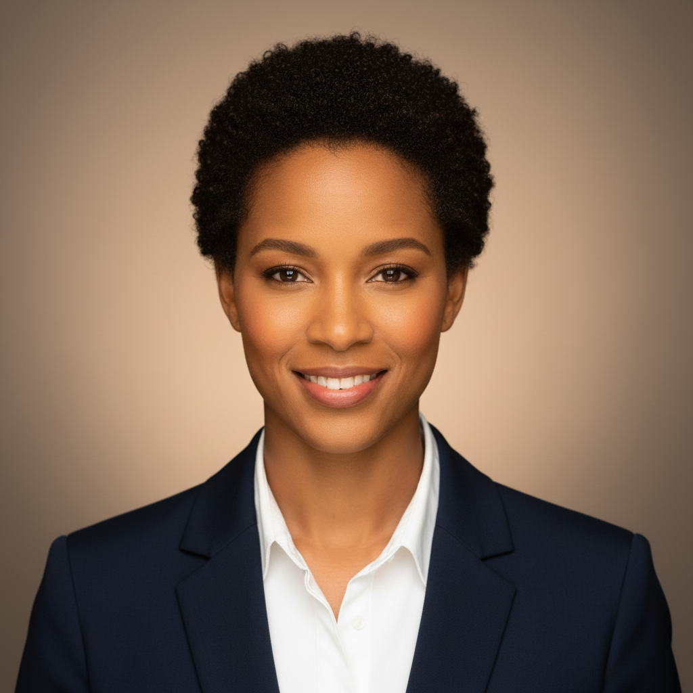
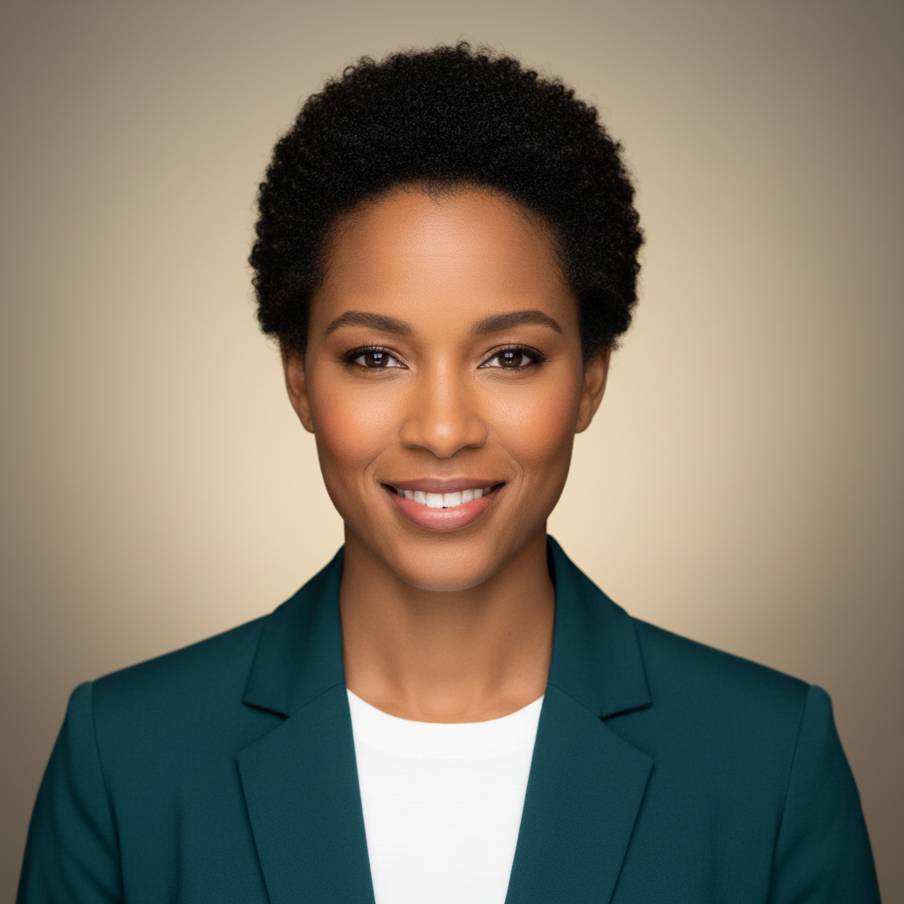
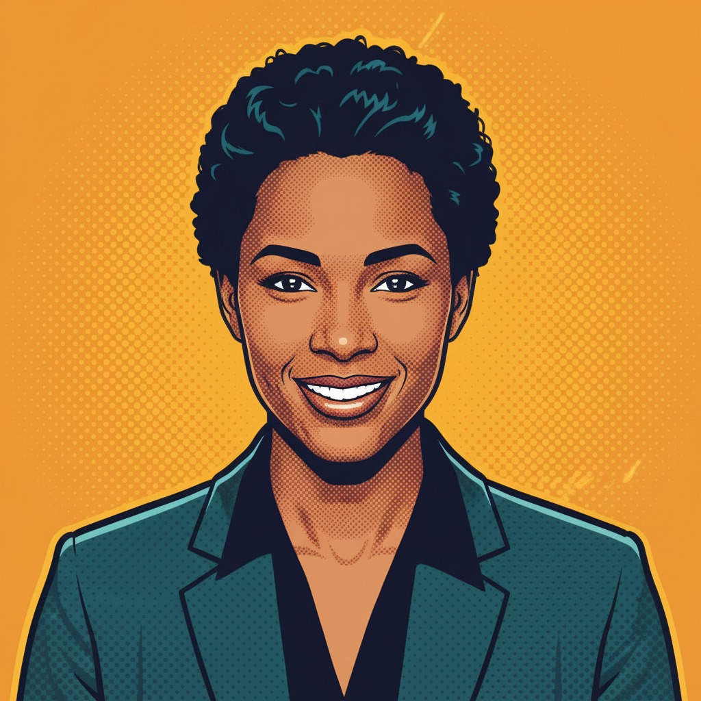
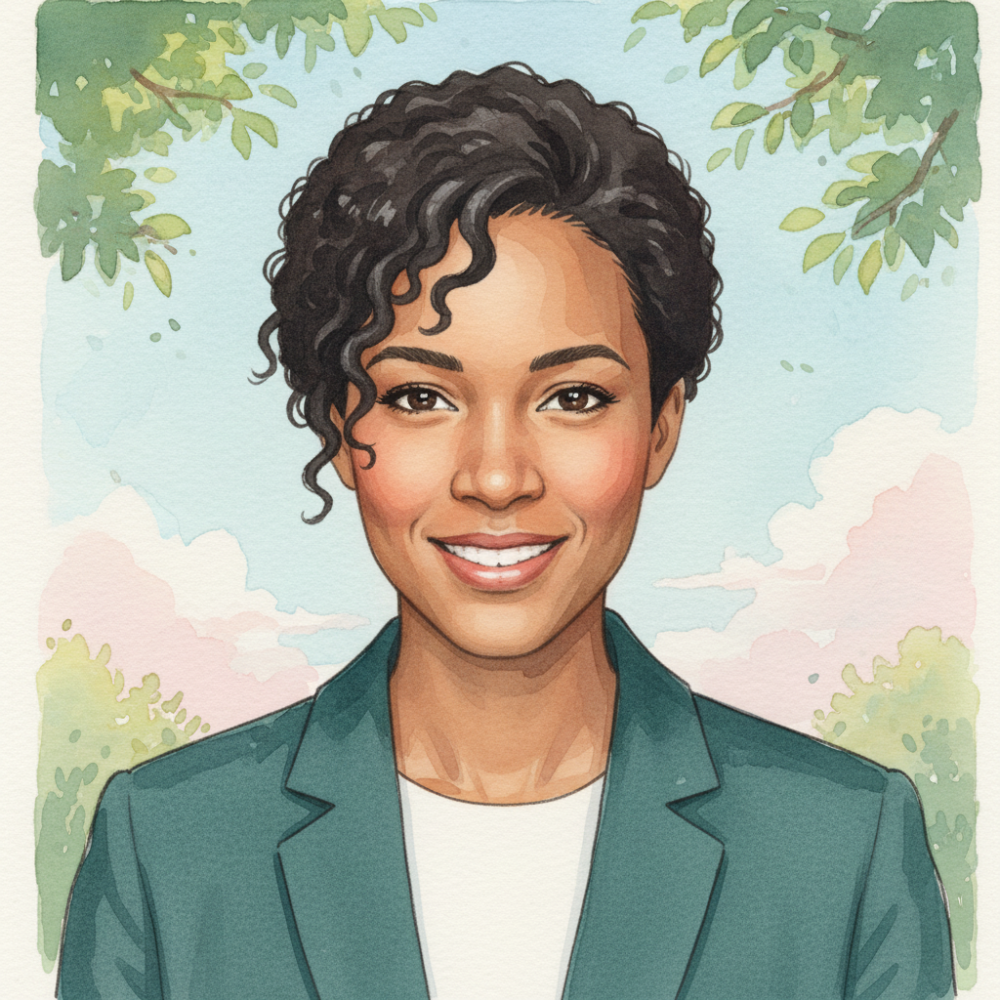
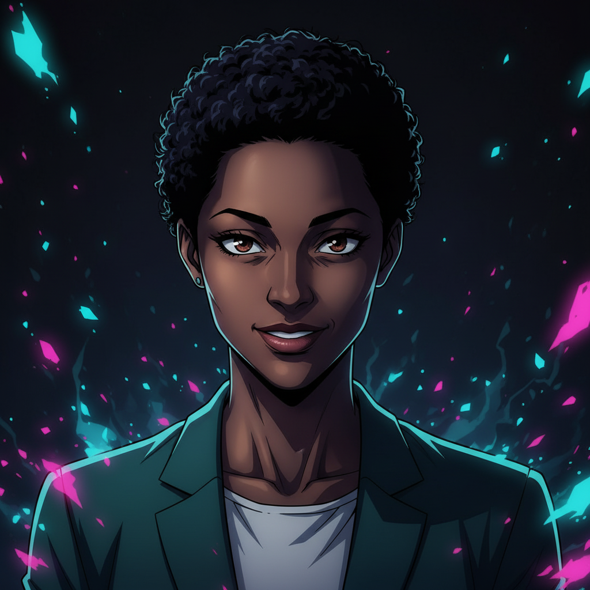
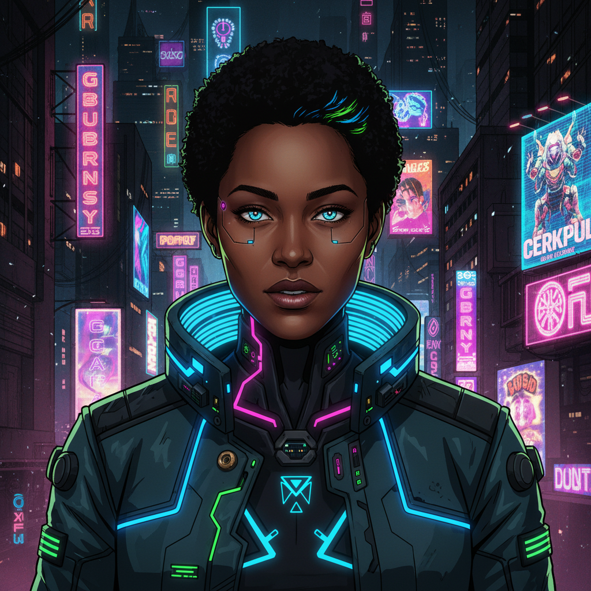

# /portrait — AI Portrait Generator

A Claude Code skill that generates AI portrait images using Google Gemini's image generation. Supports image-to-image enhancement and style transfer across 32+ presets, plus freeform text-to-image generation.

## Quick Start

```
/portrait enhance my-photo.jpg studio-classic
/portrait anime my-photo.jpg ghibli
/portrait cartoon my-photo.jpg pixar
```

Or just type `/portrait` and describe what you want — Claude will figure out the mode and style.

## Demo

All images below were generated from a single AI-generated base portrait (no real person). The same source image was transformed across different modes and styles:

### Source Image

<p align="center">
  
</p>

### enhance mode — Professional Headshot

<p align="center">
  
  
</p>
<p align="center">
  <em>Original &rarr; <code>studio-warm</code></em>
</p>

### cartoon mode — Artistic Styles

<p align="center">
  
  
</p>
<p align="center">
  <em><code>pixar</code> &nbsp;&nbsp;&nbsp; <code>comic-pop</code></em>
</p>

### anime mode — 20 Anime Art Styles

<p align="center">
  
  
  
</p>
<p align="center">
  <em><code>ghibli</code> &nbsp;&nbsp;&nbsp; <code>jjk</code> &nbsp;&nbsp;&nbsp; <code>edgerunners</code></em>
</p>

> All demo images generated with `engine.py` using the `gemini-2.5-flash-image` model at ~$0.03/image.

## Prerequisites

| Requirement | Setup |
|-------------|-------|
| **Python 3.10+** | Pre-installed on most systems |
| **google-genai SDK** | `python -m pip install google-genai` |
| **Gemini API Key** | Get one at [aistudio.google.com/apikey](https://aistudio.google.com/apikey) |
| **Billing enabled** | Image generation requires a billed project (free tier limit is 0). Enable at [aistudio.google.com/billing](https://aistudio.google.com/billing) |

Set the API key as a persistent environment variable:

```bash
# Windows
setx GEMINI_API_KEY "your-key-here"

# macOS/Linux
echo 'export GEMINI_API_KEY="your-key-here"' >> ~/.zshrc
```

## Architecture

```
~/.claude/skills/portrait/
  SKILL.md          # Skill definition (Claude reads this to know what to do)
  prompts.json      # All 32 prompt templates with metadata
  engine.py         # Python CLI that calls Gemini API
  README.md         # You are here
```

**Design philosophy:** SKILL.md is lean (~150 lines) and tells Claude *how* to use the engine. The actual prompt templates live in `prompts.json` to avoid bloating Claude's context window. `engine.py` is a headless CLI — it generates images, saves them to disk, and prints paths. Claude displays the results inline.

## Modes

### 1. enhance — Professional Headshot Enhancement

Takes your photo and transforms it into a professional headshot. Adds studio lighting, professional attire, and clean backgrounds while preserving your exact face.

```bash
/portrait enhance selfie.jpg studio-classic
/portrait enhance selfie.jpg studio-warm
/portrait enhance selfie.jpg editorial
```

| Style | Look |
|-------|------|
| `studio-classic` | Dark gradient backdrop, 3-point lighting, navy blazer + gray crew |
| `studio-warm` | Warm Rembrandt lighting, golden tones, suit + white shirt |
| `editorial` | Blurred office bokeh, cinematic shadows, charcoal blazer |
| `outdoor-natural` | Golden-hour sunlight, soft nature bokeh, smart casual |
| `startup-ceo` | Modern tech founder aesthetic, minimal, confident |

### 2. cartoon — Cartoon & Artistic Styles

Converts your photo into various cartoon and artistic illustration styles.

```bash
/portrait cartoon photo.jpg pixar
/portrait cartoon photo.jpg comic-pop,watercolor
```

| Style | Look |
|-------|------|
| `pixar` | Pixar/Disney 3D animated character |
| `comic-pop` | Bold comic book / pop art with halftone dots |
| `watercolor` | Loose watercolor painting with soft washes |
| `oil-painting` | Classical oil painting with impasto texture |
| `flat-vector` | Clean flat vector, Notion/Slack avatar style |
| `caricature` | Exaggerated editorial caricature, New Yorker style |
| `chibi` | Cute super-deformed with oversized head |

### 3. anime — 20 Anime Art Styles

The largest mode. Converts your photo into specific, recognizable anime art styles — from Studio Ghibli to Jujutsu Kaisen.

```bash
/portrait anime photo.jpg ghibli
/portrait anime photo.jpg jjk,edgerunners,jojo
/portrait anime photo.jpg all    # generates all 20 styles
```

| Style | Source Anime | Aesthetic |
|-------|-------------|-----------|
| `ghibli` | Spirited Away, Totoro | Warm painterly watercolor |
| `shinkai` | Your Name, Weathering With You | Dramatic skies, golden hour, lens flares |
| `jjk` | Jujutsu Kaisen | Dark, neon cursed energy accents |
| `demon-slayer` | Kimetsu no Yaiba | Vibrant particles, patterned clothing |
| `chainsaw-man` | Chainsaw Man | Gritty, desaturated, cinematic |
| `spy-x-family` | Spy x Family | Clean, bright, expressive |
| `aot` | Attack on Titan | Dark military, intense |
| `jojo` | JoJo's Bizarre Adventure | Flamboyant, psychedelic, fashion-forward |
| `edgerunners` | Cyberpunk: Edgerunners | Neon glow, Studio Trigger energy |
| `promare` | Promare | Geometric shading, neon primaries |
| `dbz` | Dragon Ball Z | Sharp angular, spiky, bold outlines |
| `sailor-moon` | Sailor Moon | Sparkles, pastels, 90s shojo |
| `akira` | Akira (1988) | Cyberpunk, gritty realism |
| `redline` | Redline (2009) | Retro-futuristic rockabilly |
| `mob-psycho` | Mob Psycho 100 | Raw sketchy, psychic energy bursts |
| `ping-pong` | Ping Pong the Animation | Lo-fi, emotionally raw |
| `mononoke-tv` | Mononoke (2007 TV) | Ukiyo-e woodblock prints, kabuki |
| `tatami-galaxy` | The Tatami Galaxy | Pop-art chaos, geometric |
| `violet-evergarden` | Violet Evergarden | Ultra-luxury, luminous KyoAni |
| `satoshi-kon` | Paprika, Perfect Blue | Surreal, psychologically complex |

### 4. generate — Text-to-Image

Generate any image from a text description. No reference photo needed.

```bash
/portrait generate "A cyberpunk cityscape at sunset with flying cars"
/portrait generate "A cozy cabin in the mountains during winter"
```

Claude crafts a detailed prompt and passes it to the engine.

## Advanced Usage

### Multiple Styles at Once

Comma-separate styles to generate several in one run:

```bash
/portrait anime photo.jpg ghibli,jjk,edgerunners
```

### Generate All Styles in a Mode

Use `all` to batch every style:

```bash
/portrait anime photo.jpg all     # generates all 20 anime styles
/portrait cartoon photo.jpg all   # generates all 7 cartoon styles
```

### Multiple Variations

Use `--count` to generate N variations of the same style (useful for picking the best one):

```bash
python engine.py enhance photo.jpg --style studio-classic --count 3 --output ./portraits
```

### Custom Output Directory

```bash
python engine.py anime photo.jpg --style ghibli --output ~/Pictures/avatars
```

### List Available Styles

```bash
python engine.py list                # all modes and styles
python engine.py list --mode anime   # anime styles only
python engine.py list --mode enhance # enhance styles only
```

`[T]` = tested and verified. `[ ]` = prompt written but not yet battle-tested.

## Engine CLI Reference

```
Usage: engine.py {enhance,cartoon,anime,generate,list} [options]

Commands:
  enhance <image> --style <s> [--count N] [--output dir]   Professional headshot (i2i)
  cartoon <image> --style <s> [--count N] [--output dir]   Cartoon style (i2i)
  anime   <image> --style <s> [--count N] [--output dir]   Anime style (i2i)
  generate        --prompt <text> [--count N] [--output dir]   Text-to-image
  list            [--mode <mode>]                          Show available styles

Options:
  --style     Comma-separated style names, or "all"
  --count     Number of variations per style (default: 1)
  --output    Output directory (default: ./portraits)
  --prompt    Text description for generate mode
  --mode      Filter for list command
```

Output files are named `{mode}_{style}[_{n}].{ext}` (e.g., `anime_ghibli.png`, `enhance_studio-classic_2.png`).

## How It Works

1. **You say** `/portrait anime photo.jpg ghibli` (or just describe what you want)
2. **Claude** reads SKILL.md, determines mode + style, validates your image exists
3. **Claude** runs `engine.py anime photo.jpg --style ghibli --output ./portraits`
4. **engine.py** loads the prompt template from `prompts.json`, sends your photo + prompt to Gemini
5. **Gemini** generates the styled image and returns it
6. **engine.py** saves the image to disk and prints the path
7. **Claude** reads the image and displays it inline in your conversation

All image-to-image prompts include a `CRITICAL: preserve exact face` rule block to ensure the output is recognizably *you*, not a generic person.

## Prompt Quality

Each prompt template in `prompts.json` has a `status` field:

| Status | Meaning |
|--------|---------|
| `tested` | Prompt has been run against a real photo, output verified for quality and likeness |
| `draft` | Prompt written from research, not yet validated against a real photo |

6 of 32 styles are currently `tested`. Draft prompts are based on detailed research of each anime/art style and follow the same structural pattern — they should work well but may need prompt tuning for optimal results.

## Adding New Styles

1. Open `prompts.json`
2. Find the appropriate mode (`enhance`, `cartoon`, or `anime`)
3. Add a new entry under `styles`:

```json
"my-new-style": {
  "description": "One-line description for the style menu",
  "status": "draft",
  "prompt": "Transform this photo into [style description].\n\nCRITICAL: Keep the person's EXACT face...\n\nSTYLE:\n- [specific visual directions]"
}
```

4. Test it: `python engine.py anime photo.jpg --style my-new-style`
5. If it looks good, change `status` to `tested`

No code changes needed — just add to the JSON.

## Cost

Gemini image generation costs approximately **$0.02-0.04 per image**. A typical session generating 3 style variations costs ~$0.10. The engine uses the `gemini-2.5-flash-image` model.

## Troubleshooting

| Error | Cause | Fix |
|-------|-------|-----|
| `GEMINI_API_KEY not set` | Environment variable missing | `setx GEMINI_API_KEY "key"` then restart terminal |
| `429 RESOURCE_EXHAUSTED` | Free tier (limit=0 for image gen) | Enable billing at aistudio.google.com/billing |
| `ModuleNotFoundError: google` | SDK not installed | `python -m pip install google-genai` |
| `404 model not found` | Model name deprecated | Check Gemini docs for current image model names |
| Image doesn't look like me | Prompt drift or model variation | Retry with `--count 2`, or refine the prompt in prompts.json |
